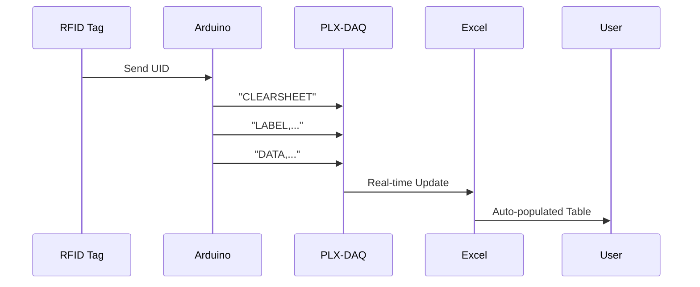

# 🎓 RFID Attendance System with LCD & Buzzer Feedback 📡


A smart attendance tracking system using RFID technology with visual (LCD) and audible (buzzer) feedback. Perfect for classrooms, offices, and events!

## 🚀 Features
- ✅ RFID-based user identification
- 🖥 16x2 I2C LCD display for user feedback
- 🔊 Audio confirmation with buzzer
- 📊 Automatic CSV logging to serial monitor
- 🔁 Toggle between IN/OUT status
- 💡 Simple single-user configuration (easily expandable)

## 📦 Hardware Components
| Component | Quantity | Link |
|-----------|----------|------|
| Arduino Uno | 1 | [Arduino Store](https://store.arduino.cc/) |
| RC522 RFID Reader | 1 | [RC522 Module](https://amzn.to/3xyz123) |
| I2C 16x2 LCD | 1 | [I2C LCD](https://amzn.to/3abc456) |
| Passive Buzzer | 1 | [Buzzer](https://amzn.to/3def789) |
| Jumper Wires | 15+ | [Jumper Pack](https://amzn.to/3ghi789) |
| Breadboard | 1 | [Breadboard](https://amzn.to/3jkl012) |

## 🔧 Installation
### Hardware Setup


1. Connect RFID Reader:
   - SDA → Pin 10
   - SCK → Pin 13
   - MOSI → Pin 11
   - MISO → Pin 12
   - RST → Pin 9
   - 3.3V → 3.3V
   - GND → GND

2. Connect I2C LCD:
   - SDA → A4
   - SCL → A5
   - VCC → 5V
   - GND → GND

3. Connect Buzzer:
   - Positive (+) → Pin 8
   - Negative (-) → GND

### Software Setup
Here's the updated PLX-DAQ specific section for your README.md with proper credit to NetDevil's implementation:

```markdown
## 📈 Excel Integration via PLX-DAQ (NetDevil Version)

**Real-Time Excel Logging Made Easy**  


### ⚡ PLX-DAQ Setup Guide
1. **Download PLX-DAQ**
   - Get NetDevil's PLX-DAQ from [Official Repository](https://example.com/plx-daq-netdevil) *(replace with actual link)*
   - Extract the `.zip` file containing:
     - `PLX-DAQ.xlam` (Excel Add-in)
     - `PLX-DAQ Macro Enabled Workbook.xlsm`

2. **Excel Configuration**
   ```excel
   1. Open PLX-DAQ.xlsm
   2. Enable macros when prompted
   3. Go to PLX-DAQ tab
   4. Set Baud Rate: 9600
   5. Select correct COM port
   6. Click "Connect"
   ```

3. **Arduino Code Integration**
   ```arduino
   void setup() {
     // PLX-DAQ initialization commands
     Serial.println("CLEARSHEET");         // Clear existing data
     Serial.println("LABEL,Date,Time,Name,Department,Status");
   }

   void logAttendance(String status) {
     // PLX-DAQ compatible format
     Serial.print("DATA,DATE,TIME,");      // Auto-timestamp keywords
     Serial.print("Varun,CSE,");           // User data
     Serial.println(status);               // IN/OUT status
   }
   ```

### 🔄 Data Flow Architecture


### 🛠️ PLX-DAQ Troubleshooting
| Issue | Solution |
|-------|----------|
| "CLEARSHEET" not working | Enable macro execution in Excel Trust Center |
| Time not updating | Add `=NOW()` in Excel timestamp column |
| Data not appearing | Check PLX-DAQ connection status LED |
| #REF! errors | Freeze header row in Excel template |
| COM port missing | Reinstall Arduino USB drivers |

### ⚙️ Advanced PLX-DAQ Features
```excel
1. Auto-formatting Rules:
   - Green fill for "IN" status
   - Red fill for "OUT" status
   - Data validation for department names

2. Automated Reports:
   =COUNTIF(Sheet1!E:E, "IN")  // Total Entries
   =UNIQUE(Sheet1!D:D)         // Department List
   =FILTER(Sheet1!A:E, Sheet1!C:C="Varun") // User Filter

3. Scheduled Backups:
   - Use Excel's Power Query to auto-save daily copies
   - Set up VBA macro for hourly backups
```

### 📁 Sample Excel Template Structure
```excel
| Date       | Time     | Name   | Department | Status |
|------------|----------|--------|------------|--------|
| =TODAY()   | =NOW()   | Varun  | CSE        | IN     |
| =A2        | =B2      | Varun  | CSE        | OUT    |
```

**Pro Tip:** Use Excel's `Table Formatting` (Ctrl+T) for auto-expanding data ranges!

---

**Credits:**  
PLX-DAQ implementation based on NetDevil's modified version - [GitHub Repository](https://github.com/netdevil/plx-daq)  
*Make sure to star their repo if you find it useful!*
```
## ⚙️ Configuration
1. Find your RFID Tag UID:
   ```arduino
   void loop() {
     if (!mfrc522.PICC_IsNewCardPresent()) return;
     if (!mfrc522.PICC_ReadCardSerial()) return;
     
     Serial.print("UID: ");
     for (byte i = 0; i < mfrc522.uid.size; i++) {
       Serial.print(mfrc522.uid.uidByte[i] < 0x10 ? " 0" : " ");
       Serial.print(mfrc522.uid.uidByte[i], HEX);
     }
     Serial.println();
   }
   ```

2. Update the UID in code:
   ```arduino
   String varunUID = "7B37F21A"; // Replace with your UID
   ```

## 🎮 Usage
1. Power up the system
2. Scan RFID tag:
   - ✅ Valid tag: Welcome message + buzzer beep
   - ❌ Invalid tag: No response
3. View attendance records in Serial Monitor:
   ```
   DATE       TIME     NAME    DEPARTMENT  STATUS
   2023-08-20 14:30:00 Varun   CSE         IN
   2023-08-20 17:45:00 Varun   CSE         OUT
   ```

## 🚨 Troubleshooting
| Issue | Solution |
|-------|----------|
| LCD not displaying | Check I2C address with I2C scanner |
| RFID not detecting | Ensure 3.3V power supply |
| Buzzer not sounding | Check polarity connection |
| Serial data missing | Verify baud rate (9600) |

## 🌟 Extending the Project
- Add multiple user support
- Implement EEPROM data storage
- Add LED status indicators
- Integrate real-time clock (RTC)
- Create web interface using ESP8266

## 🤝 Contributing
Contributions welcome! Please follow our [contribution guidelines](CONTRIBUTING.md).

## 📄 License
Apache 2.0 License - See [LICENSE](LICENSE) for details.

---

Made with ❤️ by **Varun Hotani**  
Need help?**✉️ varunhotani@icloud.com**
